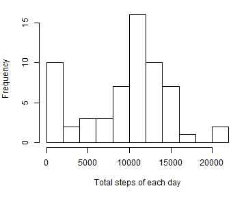
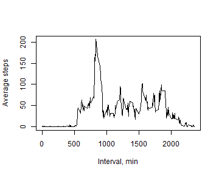
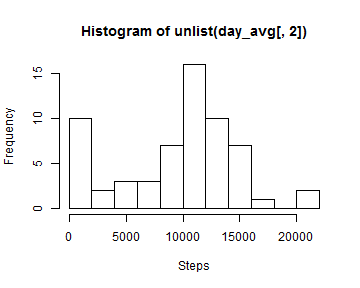
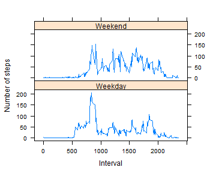

## Loading and preprocessing the data


```r
library(dplyr)
act = read.csv(file = 'activity.csv')
head(act)
```

```
##   steps       date interval
## 1    NA 2012-10-01        0
## 2    NA 2012-10-01        5
## 3    NA 2012-10-01       10
## 4    NA 2012-10-01       15
## 5    NA 2012-10-01       20
## 6    NA 2012-10-01       25
```
## What is mean total number of steps taken per day?


```r
days = unique(act$date)
by_date = group_by(act, date)
total = summarise(by_date, sum(steps, na.rm = T))
total = unlist(total[,2])
```

Total number of steps per day is shown in the histogram.

```r
par(mar = c(5, 4, 1, 1))
hist(total, xlab = 'Total steps of each day', breaks = 10, main = '')
```

 

```r
avg = round(mean(total), 1)
med = median(total)
cat('Mean of the total number of strps taken per day is:', avg)  
```

```
## Mean of the total number of strps taken per day is: 9354.2
```

```r
cat('Median of the total number of strps taken per day is:', med)
```

```
## Median of the total number of strps taken per day is: 10395
```
  
Mean of the total number of strps taken per day is: 9354.2  
Median of the total number of strps taken per day is: 10395

## What is the average daily activity pattern?

A time series plot (i.e. type = "l") of the 5-minute interval (x-axis) and the average number of steps taken, averaged across all days (y-axis)


```r
avg_step = summarise(group_by(act, interval), mean(steps, na.rm = T))
plot(avg_step, xlab = 'Interval, min', ylab = 'Average steps', type = 'l')
```

 

```r
avg_step = as.data.frame(avg_step)

pos = avg_step[, 2] == max(avg_step[, 2])
avg_step[pos, ]
```

```
##     interval mean(steps, na.rm = T)
## 104      835               206.1698
```

```r
cat('The 5-minute interval of', avg_step[pos, 1], 'on average across all the days in the dataset, contains the maximum number of steps', avg_step[pos, 2])
```

```
## The 5-minute interval of 835 on average across all the days in the dataset, contains the maximum number of steps 206.1698
```
## Imputing missing values

Note that there are a number of days/intervals where there are missing values (coded as NA). The presence of missing days may introduce bias into some calculations or summaries of the data.

1. calculates and report the total number of missing values in the dataset (i.e. the total number of rows with NAs).

2. Devise a strategy for filling in all of the missing values in the dataset using the median for that day.

3. Create a new dataset that is equal to the original dataset but with the missing data filled in.

4. Make a histogram of the total number of steps taken each day and Calculate and report the mean and median total number of steps taken per day. Do these values differ from the estimates from the first part of the assignment? What is the impact of imputing missing data on the estimates of the total daily number of steps?


```r
nmissing = sum(!complete.cases(act))
cat('The total number of missing values in the dataset is', nmissing)
```

```
## The total number of missing values in the dataset is 2304
```

```r
act_new = act
for (i in 1:nrow(act_new)){
    if (is.na(act_new$steps[i])){
        act_new$steps[i] = median(act_new$steps[act_new$interval == act_new$interval[i]], na.rm = T)    
    }
}

for (i in 1:nrow(act_new)){
    if (is.na(act_new$steps[i])){
        act_new$steps[i] = median(act_new$steps[act_new$date == act_new$date[i]], na.rm = T)    
    }
}

cat('New data set after filling missing values:')
```

```
## New data set after filling missing values:
```

```r
act_new[1:10,]
```

```
##    steps       date interval
## 1      0 2012-10-01        0
## 2      0 2012-10-01        5
## 3      0 2012-10-01       10
## 4      0 2012-10-01       15
## 5      0 2012-10-01       20
## 6      0 2012-10-01       25
## 7      0 2012-10-01       30
## 8      0 2012-10-01       35
## 9      0 2012-10-01       40
## 10     0 2012-10-01       45
```

```r
day_avg = summarise(group_by(act_new,date), sum(steps))
hist(unlist(day_avg[,2]), xlab = 'Steps', breaks = 10)
```

 

```r
mean(unlist(day_avg[,2]))
```

```
## [1] 9503.869
```

```r
median(unlist(day_avg[,2]))
```

```
## [1] 10395
```

Do these values differ from the estimates from the first part of the assignment? Yes

What is the impact of imputing missing data on the estimates of the total daily number of steps? More data involved in estimate so the results may be more acurrate.


## Are there differences in activity patterns between weekdays and weekends?

1. Create a new factor variable in the dataset with two levels - "weekday" and "weekend" indicating whether a given date is a weekday or weekend day.

2. Make a panel plot containing a time series plot (i.e. type = "l") of the 5-minute interval (x-axis) and the average number of steps taken, averaged across all weekday days or weekend days (y-axis). See the README file in the GitHub repository to see an example of what this plot should look like using simulated data.
    

```r
wds = weekdays(as.Date(act_new$date), abbreviate = T)
act_new$wd = ifelse(wds %in% c('Sun', 'Sat'), 'Weekend', 'Weekday')
act_new$wd = as.factor(act_new$wd)


avg = summarise(group_by(act_new, interval, wd), mean(steps))
colnames(avg)[3] = 'steps'

library(lattice)
xyplot(steps ~ interval | wd, avg, type = "l", layout = c(1, 2), xlab = "Interval", ylab = "Number of steps")
```

 

Weekday and weekend seem have different patterns. Weekend patten is more homogenous but in weekdays the steps in the interval between 800 to 900 are much higher than other time intervals.


```r
library(knitr)
knit2html('PA1_template.rmd')
```

```
## 
## 
## processing file: PA1_template.rmd
```

```
## 
  |                                                                       
  |                                                                 |   0%
  |                                                                       
  |.....                                                            |   7%
##   ordinary text without R code
## 
## 
  |                                                                       
  |.........                                                        |  14%
## label: unnamed-chunk-8 (with options) 
## List of 2
##  $ echo   : logi TRUE
##  $ message: logi FALSE
## 
## 
  |                                                                       
  |..............                                                   |  21%
##   ordinary text without R code
## 
## 
  |                                                                       
  |...................                                              |  29%
## label: unnamed-chunk-9 (with options) 
## List of 4
##  $ echo      : logi TRUE
##  $ message   : logi FALSE
##  $ fig.width : num 5
##  $ fig.height: num 4
## 
## 
  |                                                                       
  |.......................                                          |  36%
##   ordinary text without R code
## 
## 
  |                                                                       
  |............................                                     |  43%
## label: unnamed-chunk-10 (with options) 
## List of 4
##  $ echo      : logi TRUE
##  $ message   : logi FALSE
##  $ fig.width : num 5
##  $ fig.height: num 4
```

```
## 
  |                                                                       
  |................................                                 |  50%
##    inline R code fragments
## 
## 
  |                                                                       
  |.....................................                            |  57%
## label: unnamed-chunk-11 (with options) 
## List of 4
##  $ echo      : logi TRUE
##  $ message   : logi FALSE
##  $ fig.width : num 5
##  $ fig.height: num 4
```

```
## 
  |                                                                       
  |..........................................                       |  64%
##   ordinary text without R code
## 
## 
  |                                                                       
  |..............................................                   |  71%
## label: unnamed-chunk-12 (with options) 
## List of 4
##  $ echo      : logi TRUE
##  $ message   : logi FALSE
##  $ fig.width : num 5
##  $ fig.height: num 4
```

```
## 
  |                                                                       
  |...................................................              |  79%
##   ordinary text without R code
## 
## 
  |                                                                       
  |........................................................         |  86%
## label: unnamed-chunk-13 (with options) 
## List of 4
##  $ echo      : logi TRUE
##  $ message   : logi FALSE
##  $ fig.width : num 5
##  $ fig.height: num 4
```

```
## 
  |                                                                       
  |............................................................     |  93%
##   ordinary text without R code
## 
## 
  |                                                                       
  |.................................................................| 100%
## label: unnamed-chunk-14
```

```
## output file: PA1_template.md
```
